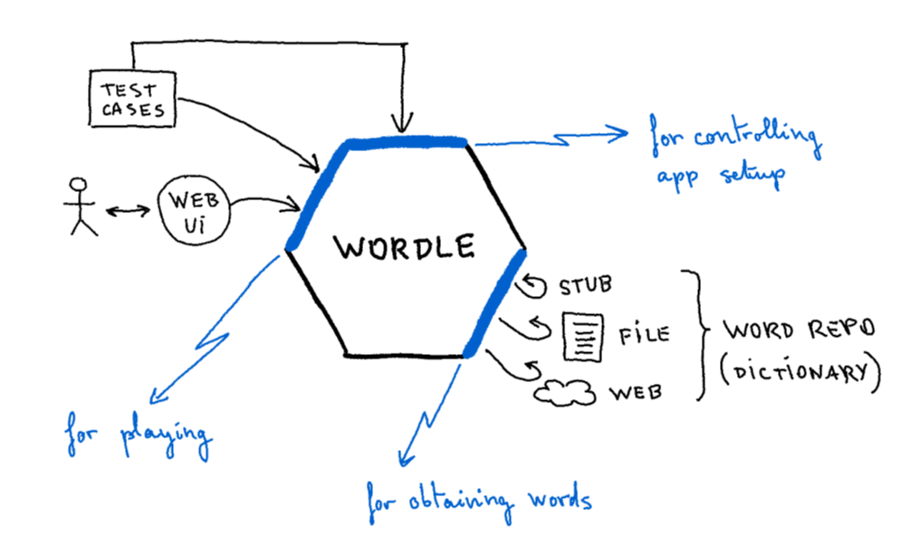

# Hexagonal Wordle
## An implementation of the popular game for guessing words, using "Hexagonal Architecture" pattern.

Designed by Juan Manuel Garrido de Paz & Alistair Cockburn.

### DEVELOPMENT SEQUENCE:

(1) FIRST STEP:

Test hardcoded hexagon with no word repository.
